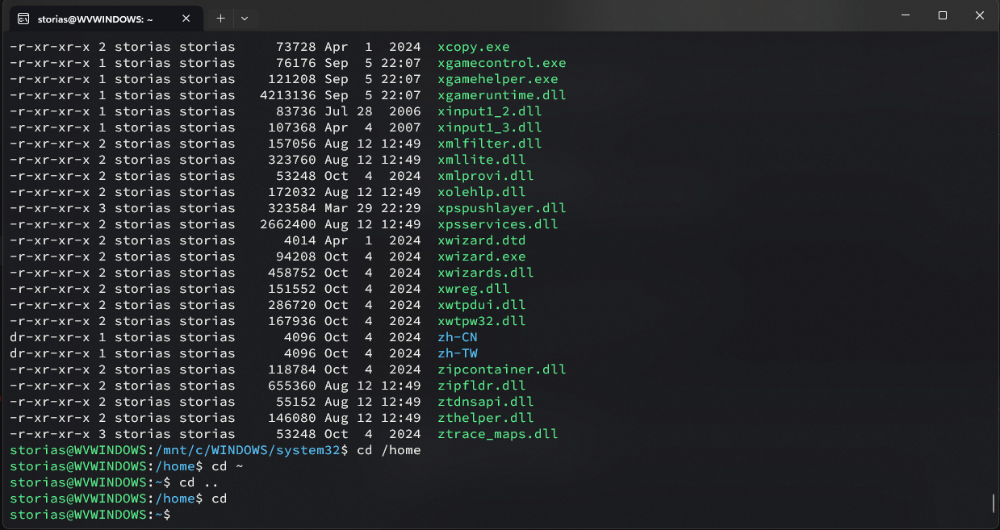
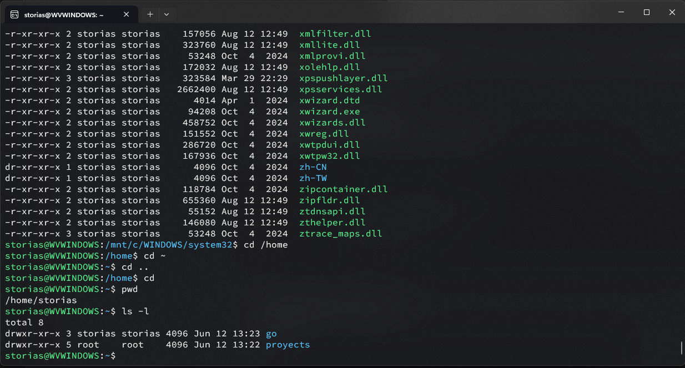

# Tarea 1 - Sistemas Operativos 1

## Integrante
- Nombre: [Tu Nombre]
- Carné: [Tu Carné]

---

## 1. Instalación de entorno Linux
Incluye aquí una breve explicación de cómo instalaste o accediste a tu entorno Linux (WSL, VM, GCP, etc.) y una captura de pantalla.

---

## 2. Comandos básicos

### Navegación de directorios
- `cd`, `ls`, `pwd`

#### Captura 1: Uso de cd, ls, pwd

### Manipulación de archivos
- `touch`, `cp`, `mv`, `rm`

### Visualización de contenido
- `cat`, `more`, `less`

### Gestión de permisos
- `chmod`, `chown`

---

## 3. Script Bash: simulacion_crear_contenedores.sh

Incluye el código del script y explica su funcionamiento.

---

## 4. Ejecución del script
Incluye capturas de pantalla mostrando la ejecución del script y los archivos generados.

---

## 5. Evidencias
Agrega aquí todas las capturas de pantalla solicitadas.

---

## 6. Enlace al repositorio
[Coloca aquí el link de tu repositorio en GitHub]
