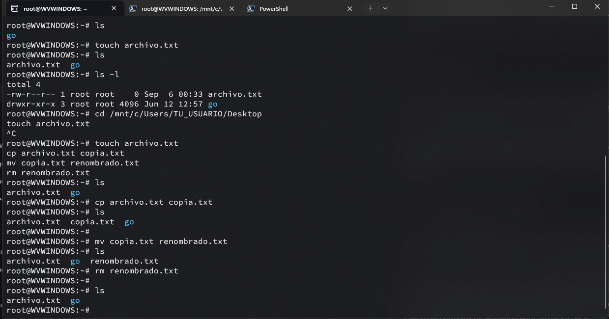
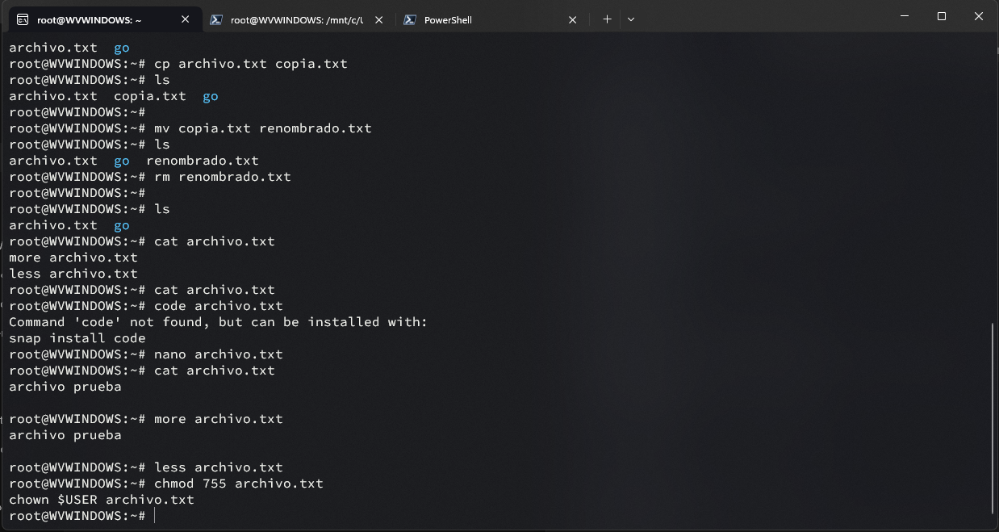
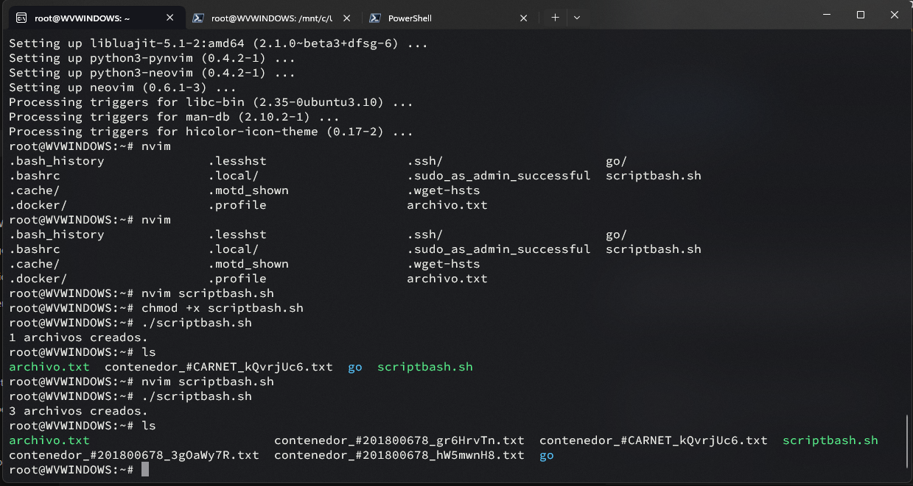

# Tarea 1 - Sistemas Operativos 1

## Integrante
- Nombre: Wilmer Estuardo Vasquez Raxon 
- Carné: 201800678


---

## Comandos básicos

### Navegación de directorios
- `cd`, `ls`, `pwd`

#### Captura 1: Uso de cd, ls, pwd


### Manipulación de archivos
- `touch`, `cp`, `mv`, `rm`


### Visualización de contenido
- `cat`, `more`, `less`


### Gestión de permisos
- `chmod`, `chown`


---

## Script Bash: simulacion_crear_contenedores.sh

```bash
    #!/bin/bash

    # Generar un número aleatorio entre 1 y 4
    cantidad=$((RANDOM % 4 + 1))

    for ((i=1; i<=cantidad; i++)); do
    nombre_aleatorio=$(tr -dc A-Za-z0-9 </dev/urandom | head -c 8)
    nombre_archivo="contenedor_#201800678_${nombre_aleatorio}.txt"
    echo "$nombre_archivo" > "$nombre_archivo"
    done

    echo "$cantidad archivos creados."
```
---

## Ejecución del script
Incluye capturas de pantalla mostrando la ejecución del script y los archivos generados.


---
